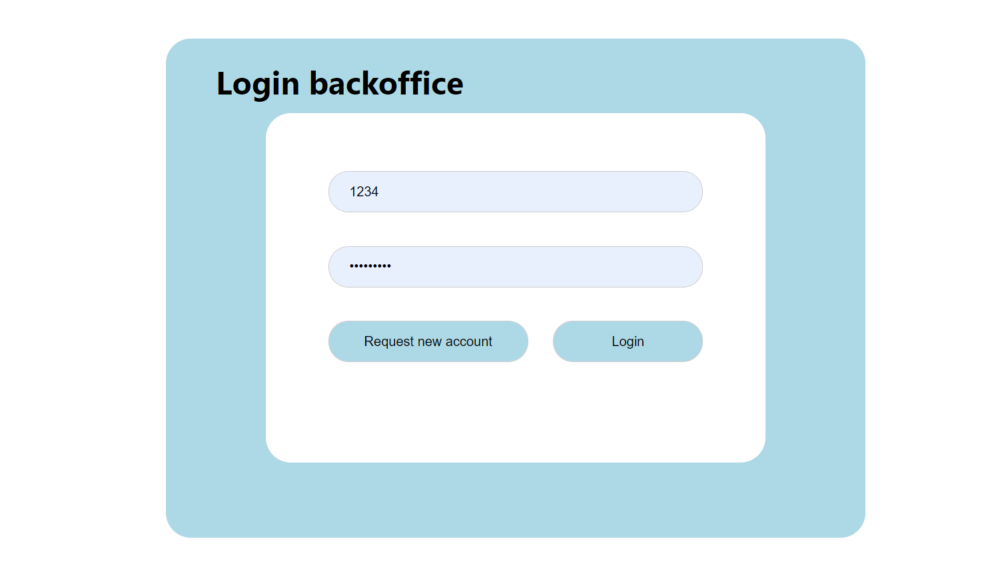
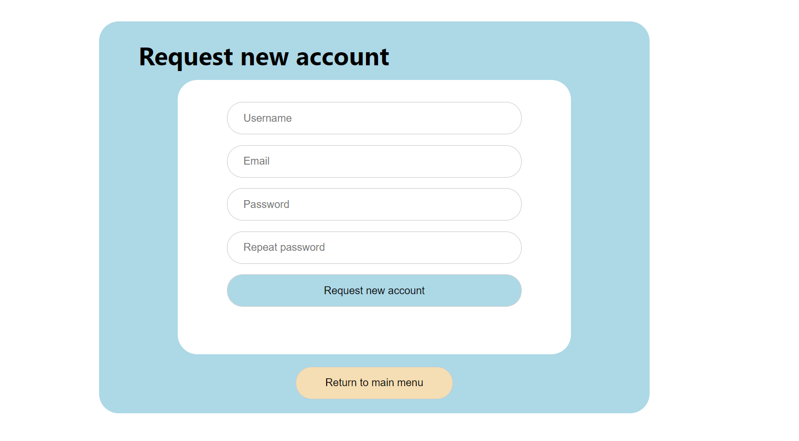
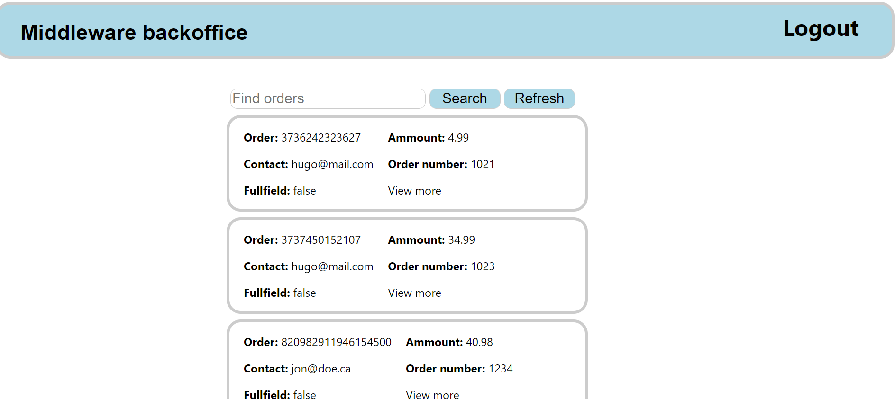

# README


This repository contains the back office for the ambar science middleware application, using the back office users can visualize orders, analyze charts, and request new accounts. Admins have the possibility of reviewing requests and creating new accounts.

## Cloning and running 

To run this app first clone this repository and then execute the command:

```bash
npm start
```

## Functionalities

### Login



### Request new account




### Visualize orders


